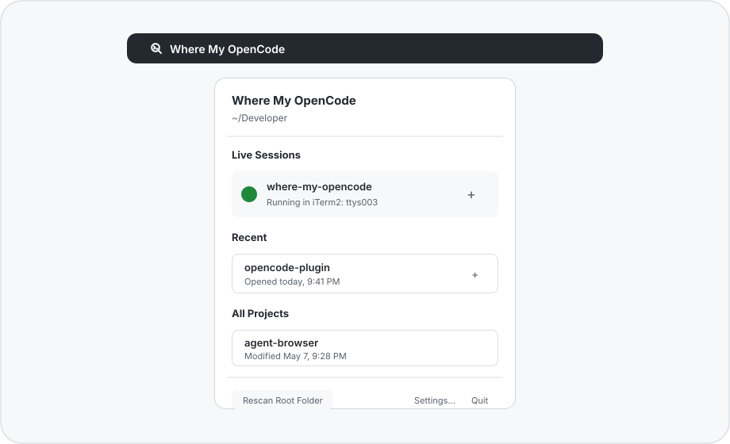

# Where My OpenCode

[English](README.md) | [한국어](README.ko.md)

OpenCode 세션을 프로젝트별로 열고, 추적하고, 다시 앞으로 가져오는 macOS 메뉴바 앱입니다.

`where-my-opencode`는 여러 프로젝트의 OpenCode 세션을 더 빠르게 열고, 찾고, 다시 앞으로 가져올 수 있도록 도와줍니다.

여러 프로젝트에서 OpenCode를 사용하는 사람이 필요한 세션으로 빠르게 돌아갈 수 있게 만든 가벼운 companion 앱입니다.



## 기능

- 루트 폴더를 스캔해 프로젝트 찾기
- 메뉴바에서 프로젝트를 OpenCode로 열기
- 앱에서 실행한 세션 추적하기
- 알고 있는 프로젝트의 실행 중인 OpenCode 세션 표시하기
- 기존 프로젝트 세션을 다시 앞으로 가져오기
- 최근 프로젝트를 가까이에 유지하기
- Apple Terminal 또는 iTerm2 선택하기

## 설치

최신 GitHub Release에서 `Where-My-OpenCode-v<version>-macOS-unsigned.zip`을 다운로드하고, 압축을 푼 뒤 `Where My OpenCode.app`을 `/Applications`로 옮기세요.

## 요구 사항

- macOS
- `opencode`로 실행 가능한 OpenCode, 또는 Settings에서 선택한 사용자 지정 실행 파일
- Apple Terminal 또는 iTerm2

## 첫 실행

이 앱은 Apple Developer ID로 notarization되지 않은 상태로 배포되므로, macOS가 첫 실행을 차단할 수 있습니다.

macOS에서 Apple이 앱을 확인할 수 없다고 표시하는 경우:

1. Done을 클릭합니다.
2. System Settings > Privacy & Security를 엽니다.
3. Security 섹션에서 Where My OpenCode의 Open Anyway를 클릭합니다.
4. 비밀번호 또는 Touch ID로 확인한 뒤 Open을 클릭합니다.

첫 승인 이후에는 다른 앱처럼 실행할 수 있습니다.

Terminal에서 다운로드 quarantine을 제거할 수도 있습니다.

```bash
xattr -dr com.apple.quarantine "/Applications/Where My OpenCode.app"
open "/Applications/Where My OpenCode.app"
```

Where My OpenCode가 선택한 터미널을 제어할 수 있도록 macOS가 Automation 권한을 요청할 수 있습니다. 루트 폴더를 선택할 때 폴더 접근 권한을 요청할 수도 있습니다.

## 상태

Where My OpenCode는 초기 preview입니다. 현재는 프로젝트 탐색, 앱에서 실행한 세션 추적, 실행 중인 세션 감지, 터미널 창 포커싱에 초점을 맞추고 있습니다.

## 라이선스

MIT. 자세한 내용은 [LICENSE](LICENSE)를 참고하세요.
